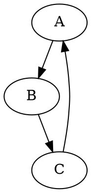
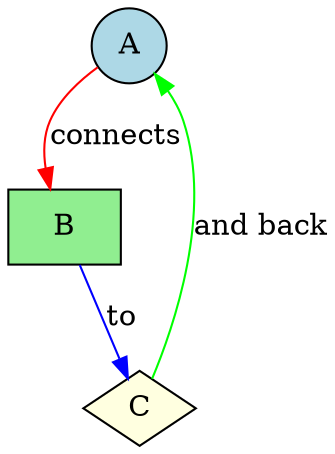
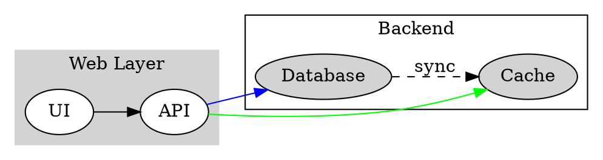
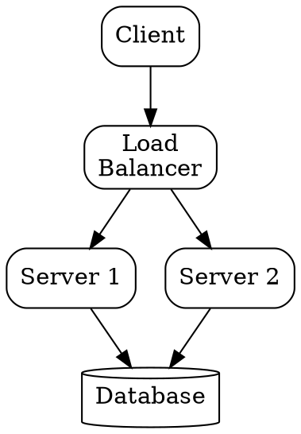
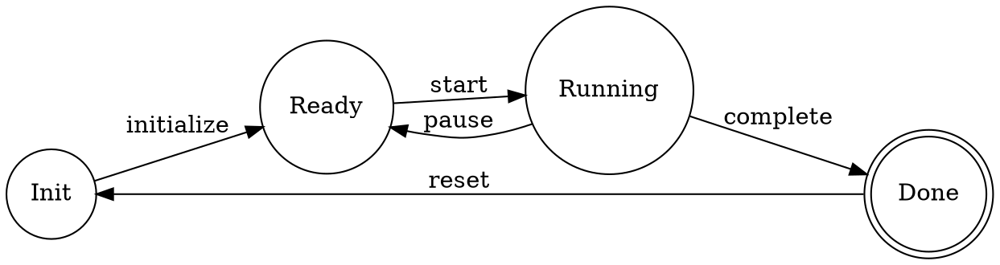
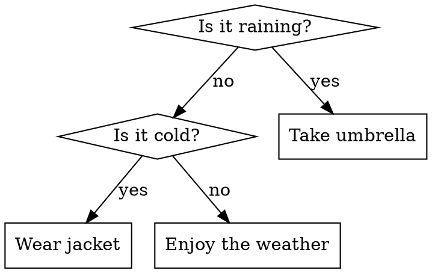

# Quick Start Guide

Get started with Graphviz Visual Editor in 5 minutes!

## Choose Your Platform

### 🌐 Web Browser

1. **Clone and Install**
   ```bash
   git clone https://github.com/magjac/graphviz-visual-editor
   cd graphviz-visual-editor
   npm install
   make
   ```

2. **Run**
   ```bash
   npm start
   ```

3. **Open** your browser at http://localhost:3000

### 💻 VSCode Extension

1. **Build**
   ```bash
   git clone https://github.com/magjac/graphviz-visual-editor
   cd graphviz-visual-editor
   npm install
   make
   ./build-vscode-extension.sh
   ```

2. **Install**
   - Open VSCode
   - Press `Ctrl+Shift+X` (Extensions)
   - Click "..." → "Install from VSIX..."
   - Select `vscode-extension/graphviz-visual-editor-*.vsix`

3. **Use**
   - Open any `.dot` or `.gv` file
   - Right-click → "Open With..." → "Graphviz Visual Editor"

## Your First Graph

### Create a Simple Graph



### Add Some Style



### Try Complex Layouts



## Basic Operations

### 🖱️ Mouse Operations

| Action | Result |
|--------|--------|
| **Left Click** on canvas | Deselect all |
| **Left Click** on node/edge | Select component |
| **Ctrl+Left Click** | Multi-select |
| **Left Drag** on canvas | Area select |
| **Right Click** on node | Start drawing edge |
| **Double Click** on node | Finish drawing edge |
| **Middle Click** on canvas | Insert node |
| **Scroll Wheel** | Zoom in/out |

### ⌨️ Keyboard Shortcuts

| Shortcut | Action |
|----------|--------|
| `Delete` | Delete selected |
| `Ctrl+C` | Copy node attributes |
| `Ctrl+V` | Paste/insert node |
| `Ctrl+X` | Cut node |
| `Ctrl+A` | Select all nodes |
| `Ctrl+Z` | Undo |
| `Ctrl+Y` | Redo |
| `Escape` | Cancel/deselect |
| `F` | Fullscreen |
| `?` | Show help |

## Common Tasks

### Adding Nodes

**Method 1: Click the Insert Panel**
1. Click "Insert" in toolbar
2. Choose a shape
3. Click on canvas to place

**Method 2: Middle Click**
- Middle-click on canvas to insert default node

**Method 3: Copy-Paste**
1. Select a node
2. Press `Ctrl+C`
3. Press `Ctrl+V`

### Drawing Edges

1. Right-click on start node
2. Move mouse (edge follows cursor)
3. Double-click on end node

### Styling Nodes

1. Click "Node Format" button
2. Choose style, color, and fill color
3. Newly inserted nodes use these defaults

### Changing Layout

**Web App:**
- Settings → Engine → Select layout (dot, neato, etc.)

**VSCode:**
- File → Preferences → Settings
- Search "Graphviz"
- Change "Graphviz: Engine"

## Example Use Cases

### 🗺️ Architecture Diagram



### 📊 State Machine



### 🌳 Decision Tree



## Tips & Tricks

### 💡 Pro Tips

1. **Use Subgraphs** for grouping related nodes
2. **Set rankdir** for horizontal layouts: `rankdir=LR;`
3. **Use Colors** to highlight important paths
4. **Add Labels** to edges for clarity
5. **Try Different Engines** for different graph types:
   - `dot` - hierarchical graphs
   - `neato` - spring model layouts
   - `circo` - circular layouts
   - `fdp` - force-directed layouts

### 🎨 Color Reference

Common color names:
- `lightblue`, `lightgreen`, `lightyellow`, `lightpink`
- `red`, `green`, `blue`, `orange`, `purple`
- Hex colors: `#FF6B6B`, `#4ECDC4`, `#95E1D3`

### 📐 Shape Reference

Common shapes:
- `box`, `circle`, `ellipse`, `diamond`
- `pentagon`, `hexagon`, `octagon`
- `cylinder`, `folder`, `tab`
- `note`, `component`, `record`

## Troubleshooting

### ❌ Common Issues

**Graph doesn't render**
- Check DOT syntax is valid
- Look for error messages in the error indicator
- Try simpler graph first

**Can't select nodes**
- Click outside graph to deselect first
- Try clicking on the node label area

**Edges not drawing**
- Right-click (not left-click) to start
- Double-click (not single) to finish
- Make sure you're clicking on nodes, not canvas

## Next Steps

📚 **Learn More:**
- [Graphviz Documentation](https://graphviz.org/documentation/)
- [DOT Language Guide](https://graphviz.org/doc/info/lang.html)
- [Node Shapes Gallery](https://graphviz.org/doc/info/shapes.html)
- [Color Names](https://graphviz.org/doc/info/colors.html)

🔧 **Advanced Usage:**
- [VSCode Extension Guide](VSCODE_EXTENSION.md)
- [Full Feature List](README.md#implemented-features)

💬 **Get Help:**
- [GitHub Issues](https://github.com/magjac/graphviz-visual-editor/issues)
- [Report Bugs](https://github.com/magjac/graphviz-visual-editor/issues/new)

Happy graphing! 🎉

